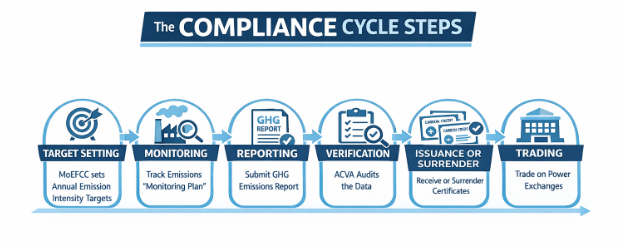
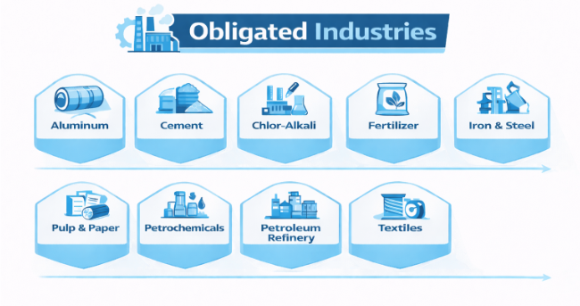
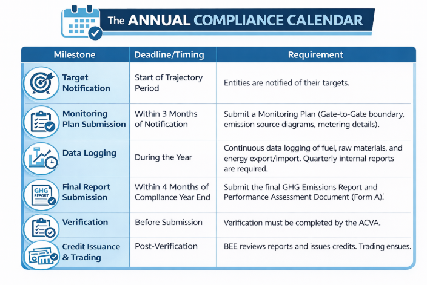

# Indian Carbon Market 101  
## A Beginner’s Guide to the Carbon Credit Trading Scheme (CCTS)

---

## Introduction: Carbon as the New Currency

India has committed to achieving **Net Zero by 2070**. With the country contributing nearly **7% of global CO₂ emissions**, the government has introduced the **Carbon Credit Trading Scheme (CCTS)** to reduce emission intensity by **45% by 2030**.

The **Indian Carbon Market (ICM)** transforms carbon emissions from a mere environmental metric into a **tradable financial asset**, encouraging industries to decarbonize while rewarding efficiency leaders.

This document explains the **What, How, Who, When, and Why** of the Indian Carbon Market in simple terms.

---

## 1. What is the Indian Carbon Market?

The **Indian Carbon Market (ICM)** is a regulatory **cap-and-trade framework** designed to reduce greenhouse gas (GHG) emissions by assigning a **price to carbon**.

### Core Concept

- **Cap (Target)**  
  The government sets **emission-intensity targets** (emissions per unit of output) for selected industries.

- **Trade (Market)**  
  - Companies emitting **below** their target earn **Carbon Credit Certificates (CCCs)**  
  - Companies emitting **above** their target must **purchase CCCs** to comply  

**1 Carbon Credit Certificate (CCC) = 1 tonne of CO₂ equivalent reduced**

### Mechanisms Under CCTS

1. **Compliance Mechanism**  
   Mandatory for large, energy-intensive **Obligated Entities**.

2. **Offset Mechanism**  
   Voluntary participation for non-obligated entities such as renewable energy, waste management, and agro-forestry projects.

---

## 2. How Does the System Work?

The carbon credit lifecycle follows strict **Monitoring, Reporting, and Verification (MRV)** requirements to ensure transparency and credibility.

### Compliance Workflow

1. **Target Setting**  
   Annual emission-intensity targets are notified by the Ministry of Environment, Forest and Climate Change (MoEFCC).

2. **Monitoring**  
   Companies track fuel, electricity, and process emissions using a **BEE-approved Monitoring Plan**.

3. **Reporting**  
   A detailed **GHG Emissions Report** is submitted within **four months** of the compliance year ending.

4. **Verification**  
   - Conducted by an **Accredited Carbon Verification Agency (ACVA)**  
   - Strict **2% materiality threshold**  
   - Reports exceeding this limit must be corrected before approval

5. **Issuance or Surrender**  
   - Emissions below target → credits issued  
   - Emissions above target → credits surrendered

6. **Trading**  
   Carbon Credit Certificates are traded on **CERC-registered power exchanges**.

---

## Carbon Credit Calculation Logic

The number of carbon credits earned or required is calculated using the following formula:

**Credits = (Target Intensity − Achieved Intensity) × Total Production**

### Interpretation

- **Surplus Scenario**  
  If the achieved emission intensity is **lower than the target**, the entity earns credits that can be sold in the market.

- **Deficit Scenario**  
  If the achieved emission intensity is **higher than the target**, the entity must buy credits to meet compliance obligations.

This mechanism rewards **energy efficiency, cleaner technology, and operational improvements**.

---

## 3. Who Is Involved?

The Indian Carbon Market operates through a coordinated ecosystem of regulators, administrators, auditors, and industries.

### Key Stakeholders

- **Bureau of Energy Efficiency (BEE)** – Market administrator and issuer of credits  
- **Ministry of Power (MoP)** – Recommends covered sectors and targets  
- **Accredited Carbon Verification Agencies (ACVA)** – Independent third-party auditors  
- **Central Electricity Regulatory Commission (CERC)** – Regulates trading on exchanges  

### Obligated Entities (Phase 1)

The scheme builds upon the **Perform, Achieve and Trade (PAT)** program, which covered **1,333 units** and avoided **109 million tonnes of CO₂ annually**.

Industries covered in the initial phase include:

- Aluminum  
- Cement  
- Chlor-Alkali  
- Fertilizer  
- Iron & Steel  
- Pulp & Paper  
- Petrochemicals  
- Petroleum Refineries  
- Textiles  

---

## 4. When Is This Happening?

The framework is **already active**, and obligated entities must follow strict annual compliance timelines.

India’s **National Electricity Plan** highlights rapid grid decarbonization:

- **41%** non-fossil installed capacity (2021–22)  
- **57%** by 2026–27  
- **68%** by 2031–32  

This evolving energy mix must be incorporated into **long-term compliance strategies**.

---

## Annual Compliance Calendar

Key milestones include:

- Notification of emission-intensity targets  
- Submission of monitoring plans  
- Continuous emissions data logging  
- Annual GHG reporting  
- Independent third-party verification  
- Credit issuance and trading  

---

## 5. Why Does This Matter?

### Strategic Opportunity

- Creation of a **new revenue stream** through efficiency improvements  
- Improved **global competitiveness**, especially under mechanisms such as the EU’s Carbon Border Adjustment Mechanism (CBAM)

### Financial Risk

- Rising compliance costs under **Business-as-Usual** operations  
- Increasing carbon prices and penalties over time  

For many sectors, the **cost of decarbonization will soon be lower than the cost of non-compliance**.

---

## Conclusion

The Indian Carbon Market represents a shift from **voluntary sustainability** to **mandatory financial accountability**.  
For obligated industries and project developers alike, understanding **MRV requirements, targets, and credit economics** is now essential for long-term business viability.

---

## Sources

- Bureau of Energy Efficiency – Detailed Procedures  
- Ministry of Power – Energy Portal  
- EY Report: *CCTS: Accelerating the Path to Decarbonization* (Jan 2026)
